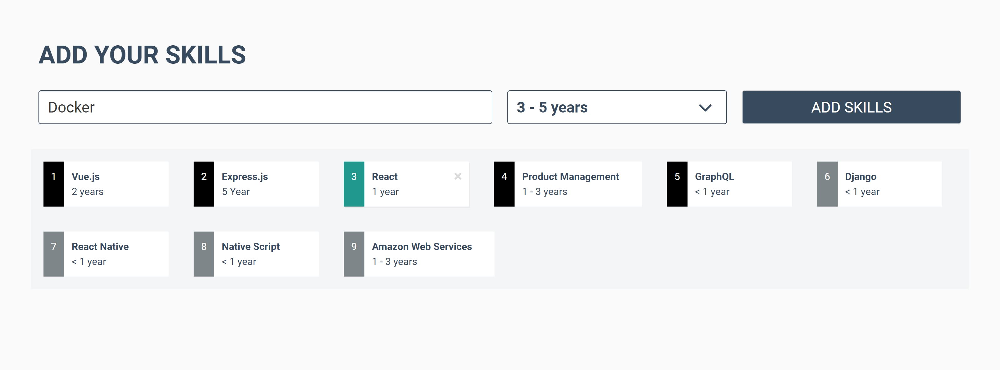
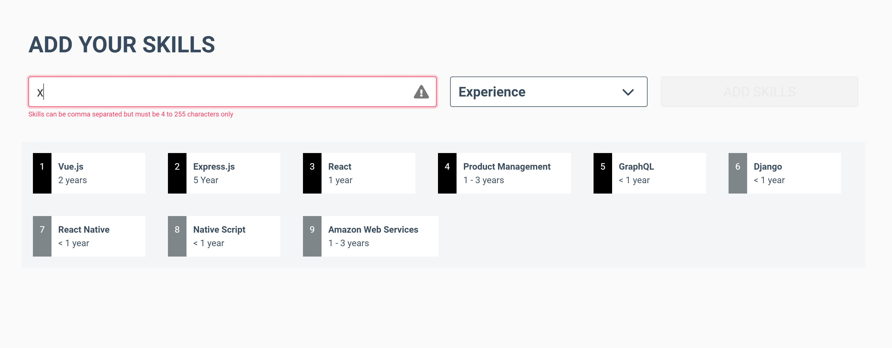
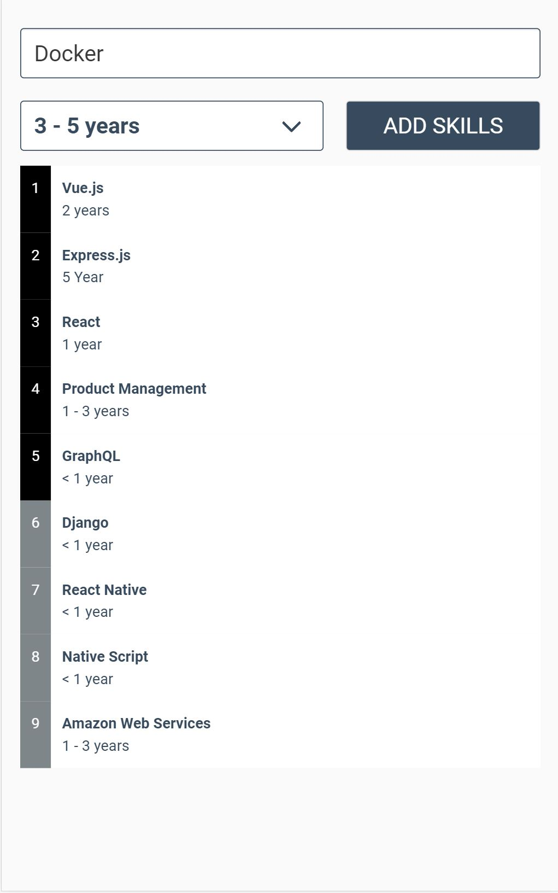

# Skiller

> An awesome VueJs app to show my "ninja" coding skills 😎

## 💾 Installation

### Prerequisites

- NodeJs 8.10 or above (for local development)
- Seed data (available [here](./docs/db.json))

### Mock API Server

```bash
npm run api
```

### Local Development

```bash
npm install

npm run serve
```

### Linting & Testing

```bash
npm run lint

npm run test:unit

npm run test:e2e

# to run both unit and end-to-end tests
npm run test
```

### Production Build

```bash
npm run build
```

## 🎯 Aim of the project

To build a VueJs multiple component app to add certain skills sets and to display them on the dashboard. The app features CRUD operations and input validations. 

## 📷 Screenshots

### Desktop View




### Desktop View (showing input error)



### Mobile View



### 🙇 Nerd Section

This is a Progressive Web App (PWA) written using [VueJs](https://vuejs.org/), [Vuex](https://vuex.vuejs.org/), [Vue Router](https://router.vuejs.org/), [Bulma](https://bulma.io), and tested with [Jest](https://jestjs.io) and [Cypress](https://www.cypress.io/). 
